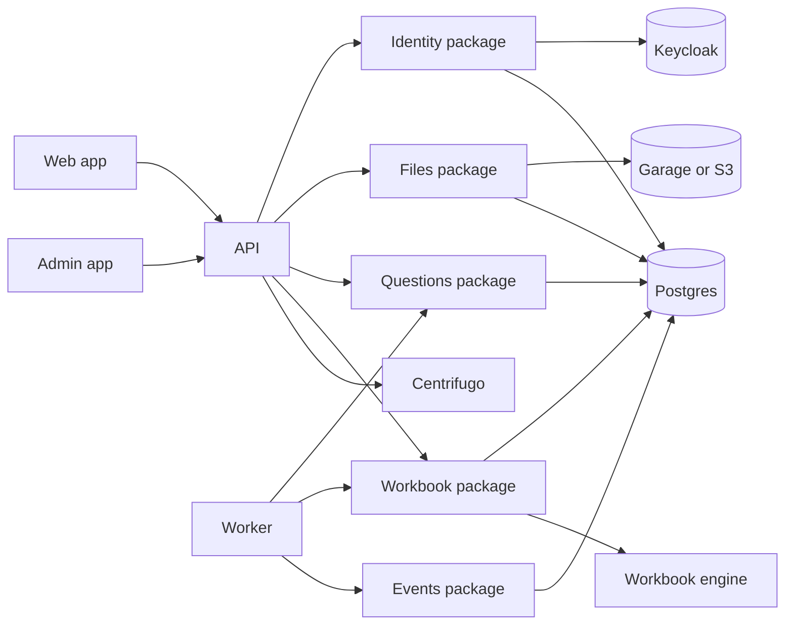

# Lemma

Lemma is a web application for creating reusable question generators from
workbooks, producing question sets, and managing the operational workflows around
those jobs.

Breaking changes are acceptable when they improve the long-term design.

## Quick Start

Prerequisites:

- Node.js 22.12 or newer
- pnpm 11.7.0
- Podman Compose for local infrastructure

Install dependencies:

```bash
pnpm install
```

Prepare local infrastructure config:

```bash
cp infra/.env.example infra/.env
```

Start local infrastructure:

```bash
pnpm infra:dev
```

Run apps from another shell:

```bash
pnpm dev
```

## Common Commands

See [Testing](docs/testing.md), [Operations](docs/operations.md), and
[Infrastructure](docs/infra.md) for current commands.

## Repository Layout

- `apps/api`: Hono API composition root.
- `apps/web`: main user-facing web app.
- `apps/admin`: admin UI.
- `apps/worker`: background worker runtime.
- `apps/keycloak-theme`: Lemma Keycloak login theme.
- `packages/*`: bounded-context packages and shared libraries.
- `infra`: local Compose infrastructure.
- `docs`: architecture, workflow, and operational documentation.

## Architecture



More detail:

- [Architecture](docs/architecture.md)
- [Domain model](docs/domain-model.md)
- [Local infrastructure](docs/infra.md)
- [Generated files](docs/generated-files.md)
- [Deployment](docs/deployment.md)
- [Testing](docs/testing.md)
- [Operations](docs/operations.md)

## Development

See [DEVELOPMENT.md](DEVELOPMENT.md) for workflow and
[Generated Files](docs/generated-files.md) for generated-output ownership.
