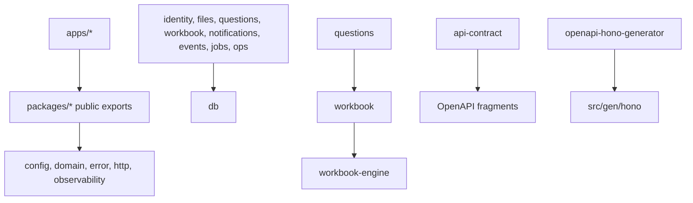
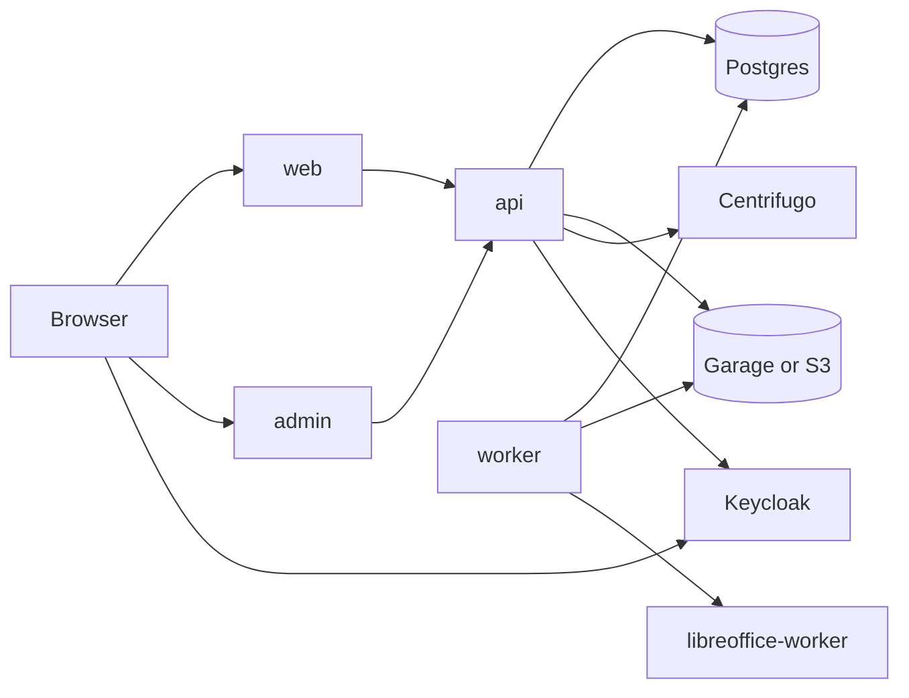
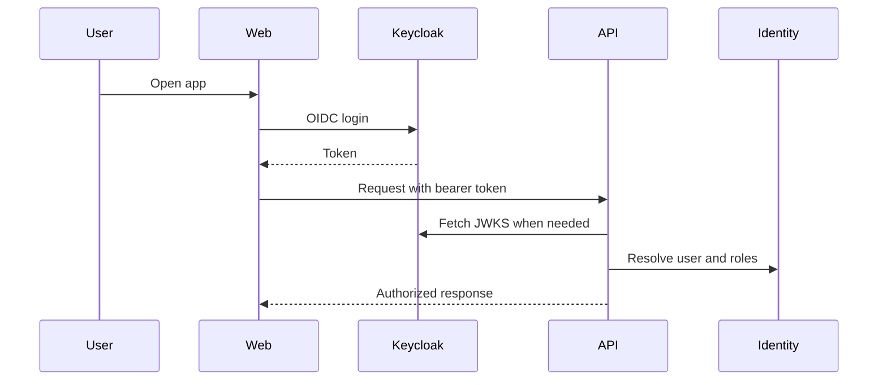
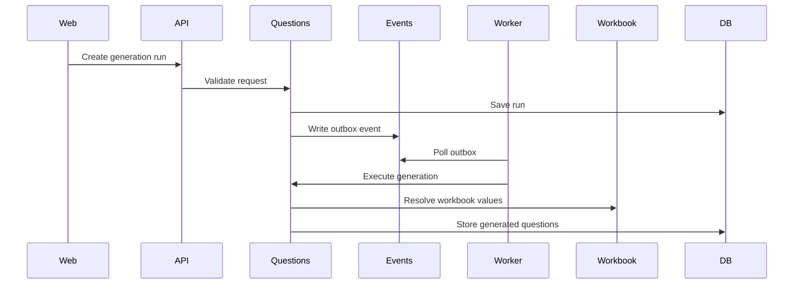
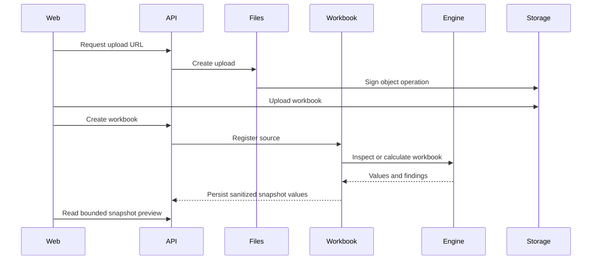
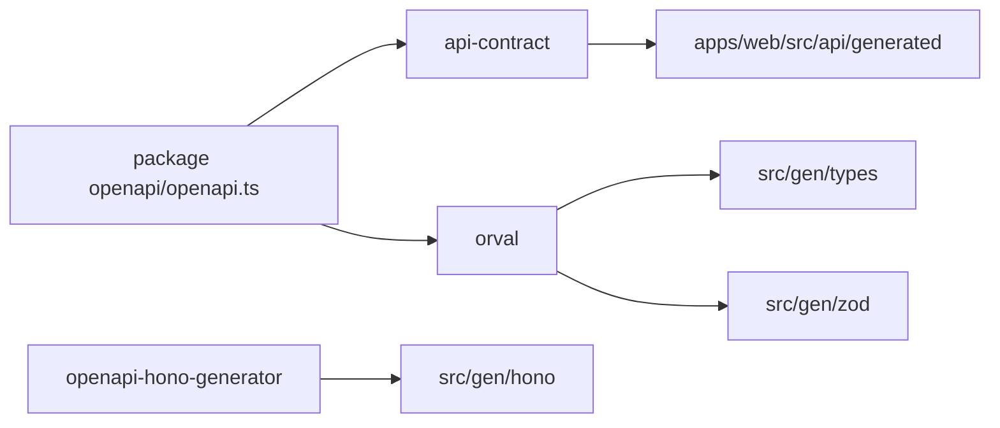

# Architecture

Lemma is a web application organized as a pnpm/Turbo workspace. Apps compose
package modules; packages own domain logic, infrastructure adapters, generated
HTTP contracts, or shared UI.

## Package Direction

Rules:

- apps may compose packages
- packages may import other packages through public exports
- packages must not import another package's `src/*`
- packages must not import another package's `dist/*`
- relative imports must not cross workspace package source roots
- each workspace package must declare imported package dependencies
- new public entry points must be added to `package.json` exports intentionally
- generated files are regenerated, not hand edited

## Runtime Services

## Request And Auth Flow

## Question Generation Flow

## Workbook Flow

## OpenAPI Generation Flow

