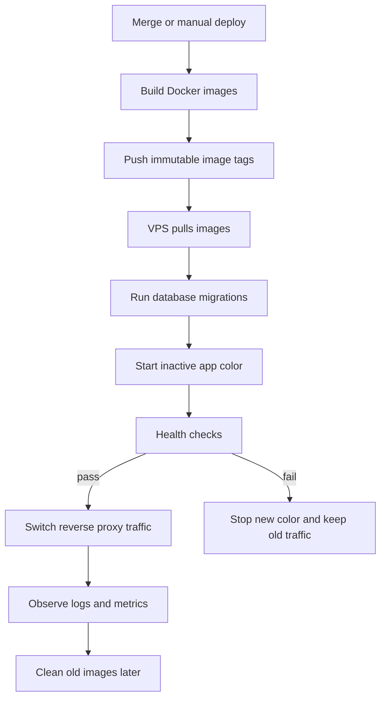
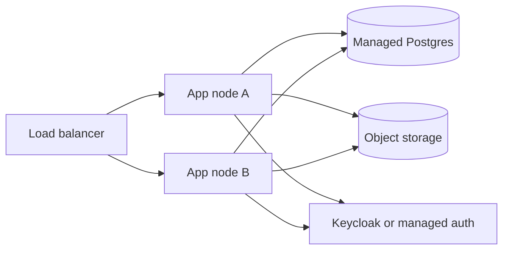

# Deployment

Production deployment is expected to build immutable images, run database
migrations deliberately, and roll application containers without interrupting
user traffic when possible.

The current repository deployment target is a single Hetzner VPS. It uses Docker
Compose for Postgres, Garage S3-compatible object storage, Keycloak,
Centrifugo, LibreOffice worker, API, worker, web, admin, and Caddy. Ansible
owns host bootstrap and deploy file synchronization; SOPS owns the encrypted
production environment file.
See `docs/vps-deployment-runbook.md` for the operator checklist and first
deploy procedure.

## Deployment Flow



## VPS Bootstrap

Create a deploy user with Docker access, install Docker Engine with the Compose
plugin, and open only SSH, HTTP, and HTTPS at the firewall. Point these DNS
records at the VPS:

- app domain
- API domain
- admin domain
- Keycloak domain
- realtime domain

Bootstrap the host with `infra/ansible/playbooks/bootstrap.yml`. Production
configuration is committed as `infra/production/env.vps.sops.env` and decrypted
by CI with `SOPS_AGE_KEY`. The deploy workflow runs Ansible to copy the
decrypted env to `/opt/lemma/.env`, synchronize Compose, Caddy, and production
scripts, then invoke the production deploy script. Runtime rollout state lives
in `/opt/lemma/.deploy-state.env`.

Required GitHub Actions secrets:

- `VPS_HOST`
- `VPS_DEPLOY_USER`
- `VPS_SSH_PRIVATE_KEY`
- `GHCR_READ_USER`
- `GHCR_READ_TOKEN`
- `SOPS_AGE_KEY`

Required GitHub Actions variables for image build-time browser config:

- `LEMMA_WEB_APP_TITLE`
- `LEMMA_WEB_APP_URL`
- `LEMMA_WEB_API_URL`
- `LEMMA_WEB_REALTIME_URL`
- `LEMMA_WEB_OIDC_ISSUER_URI`
- `LEMMA_WEB_OIDC_CLIENT_ID`
- `LEMMA_ADMIN_APP_TITLE`
- `LEMMA_ADMIN_APP_URL`
- `LEMMA_ADMIN_API_URL`
- `LEMMA_ADMIN_OIDC_ISSUER_URI`
- `LEMMA_ADMIN_OIDC_CLIENT_ID`

## CI/CD

`.github/workflows/deploy-vps.yml` builds immutable images for API, worker, web,
admin, Keycloak theme, and LibreOffice worker. Images are pushed to GHCR with the
commit SHA tag. The deploy job decrypts the SOPS env file and runs:

```sh
ansible-playbook infra/ansible/playbooks/deploy.yml
```

Manual deploys can choose an existing image tag through `workflow_dispatch`.

## Blue/Green Rollout

`scripts/production/deploy.sh` keeps two app colors: `blue` and `green`.

1. Store the requested image tag and owner in `/opt/lemma/.deploy-state.env`.
2. Pull the requested image tag.
3. Ensure stateful services are running.
4. Run database migrations.
5. Start the inactive API, web, and admin color.
6. Wait for container health checks.
7. Switch Caddy to the new color.
8. Restart the single worker on the new image.
9. Stop the old app color.

If any new app health check fails, traffic remains on the old color.

## Zero-Downtime Rules

- Keep app containers stateless.
- Use health checks before traffic switch.
- Keep migrations backward-compatible with the old and new app versions.
- Avoid running two active worker copies unless the job handlers are idempotent.
- Keep rollback realistic: schema changes may make rollback unsafe.
- Use expand/contract migrations: add nullable columns or new tables first,
  deploy app code that writes both paths when needed, backfill separately, then
  remove old columns in a later deploy.

## Rollback

Use `scripts/production/rollback.sh` on the VPS to switch Caddy back to the
previous color after checking that the previous app containers are healthy.
Rollback is an app-traffic switch only. It does not undo database migrations,
Keycloak changes, or object storage writes.

## Backups

Use `scripts/production/backup.sh` on the VPS to write timestamped backups under
`/opt/lemma/backups` by default:

- app Postgres dump
- Keycloak Postgres dump
- Garage data archive
- Garage metadata archive

Move backups off the VPS. Backups left only on the host do not protect against
host loss.

## Single-Node Limits

A single VPS can provide near-zero-downtime app releases, but not full high
availability. Host restarts, Docker daemon restarts, database restarts, and
stateful service upgrades still cause downtime.

This setup does not make Postgres, Garage, Keycloak, Caddy, or the host itself
highly available. True HA needs external stateful services or multiple nodes
behind a load balancer.

## Future Production Shape


