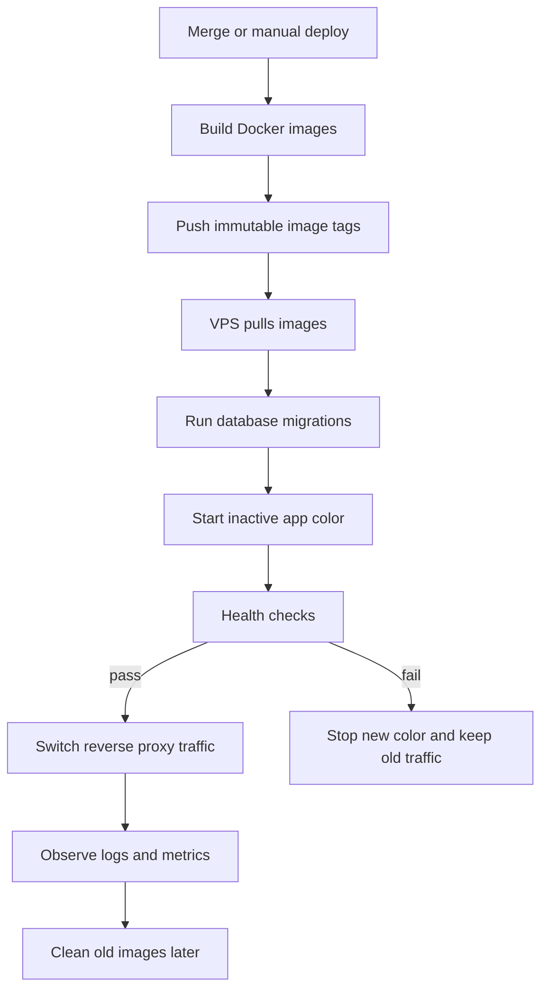
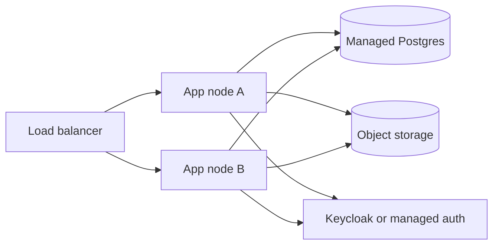

# Deployment

Production deployment is expected to build immutable images, run database
migrations deliberately, and roll application containers without interrupting
user traffic when possible.

## Deployment Flow

## Zero-Downtime Rules

- Keep app containers stateless.
- Use health checks before traffic switch.
- Keep migrations backward-compatible with the old and new app versions.
- Avoid running two active worker copies unless the job handlers are idempotent.
- Keep rollback realistic: schema changes may make rollback unsafe.

## Single-Node Limits

A single VPS can provide near-zero-downtime app releases, but not full high
availability. Host restarts, Docker daemon restarts, database restarts, and
stateful service upgrades still cause downtime.

## Future Production Shape

