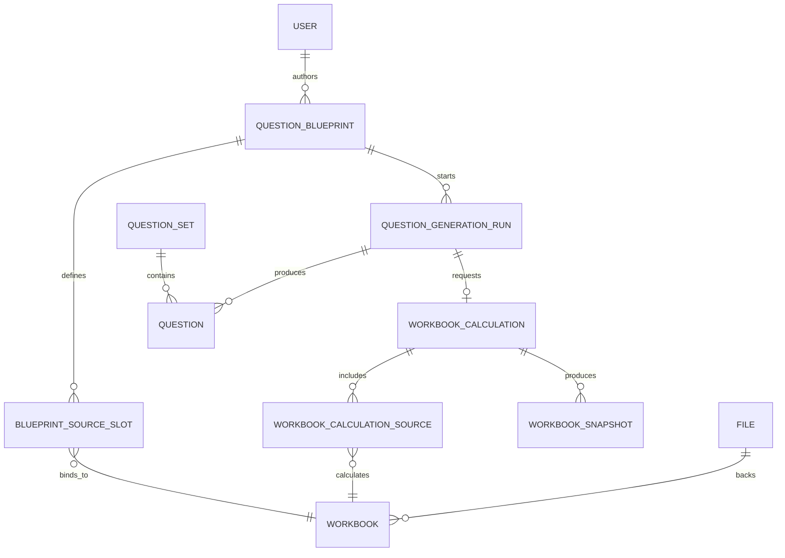

# Domain Model

## Core Terms

- Question blueprint: current editable question definition plus named source slots.
- Question set: collection of generated or curated questions.
- Question: playable question instance.
- Question generation run: asynchronous job that produces questions.
- Workbook: spreadsheet asset bound to blueprint source slots.
- Workbook snapshot: immutable sampled workbook state for one calculation source and question index.
- Workbook calculation: asynchronous sampling request covering all workbook sources frozen by a generation run.
- File upload: storage lifecycle record for uploaded content.
- Identity user: application user mapped from Keycloak.
- Outbox event: durable event used by workers and integrations.

## Relationships

## Generation Reliability

- Blueprints define current editable documents and multiple workbook-bound source slots.
- Generation runs orchestrate work and freeze blueprint documents plus source bindings as immutable inputs.
- Workbook calculations sample every frozen workbook source; snapshots preserve values per source and question index.
- Questions remember rendered body, private solution, source plan, and source evidence as durable playable artifacts.
- Viewing or grading questions reads persisted artifacts. It never recalculates workbooks.
- Retry creates replacement generation runs and replacement workbook calculations, preserving terminal history and retry lineage.

## Bounded Contexts

- `@lemma/identity`: users, roles, auth-facing identity operations.
- `@lemma/files`: upload and object storage lifecycle.
- `@lemma/workbook`: workbook registration, snapshots, calculations.
- `@lemma/questions`: authoring, generation, grading, question sets.
- `@lemma/events`: transactional outbox.
- `@lemma/notifications`: realtime auth and notification channels.
- `@lemma/ops`: operational views and repair actions.
