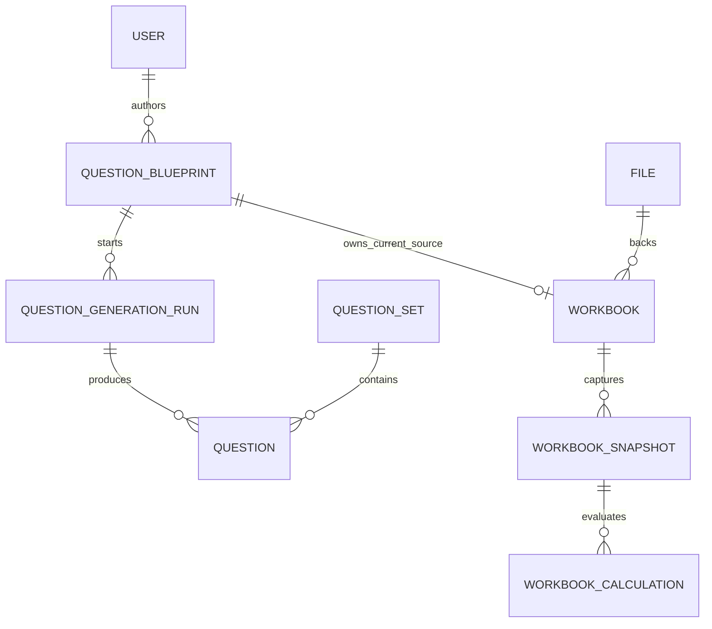

# Domain Model

## Core Terms

- Question blueprint: reusable authoring source for questions.
- Question set: collection of generated or curated questions.
- Question: playable question instance.
- Question generation run: asynchronous job that produces questions.
- Workbook: spreadsheet asset attached through a blueprint/package workflow.
- Workbook snapshot: captured workbook state.
- Workbook calculation: evaluated workbook values from an engine.
- File upload: storage lifecycle record for uploaded content.
- Identity user: application user mapped from Keycloak.
- Outbox event: durable event used by workers and integrations.

## Relationships

## Bounded Contexts

- `@lemma/identity`: users, roles, auth-facing identity operations.
- `@lemma/files`: upload and object storage lifecycle.
- `@lemma/workbook`: workbook registration, snapshots, calculations.
- `@lemma/questions`: authoring, generation, grading, question sets.
- `@lemma/events`: transactional outbox.
- `@lemma/notifications`: realtime auth and notification channels.
- `@lemma/ops`: operational views and repair actions.
