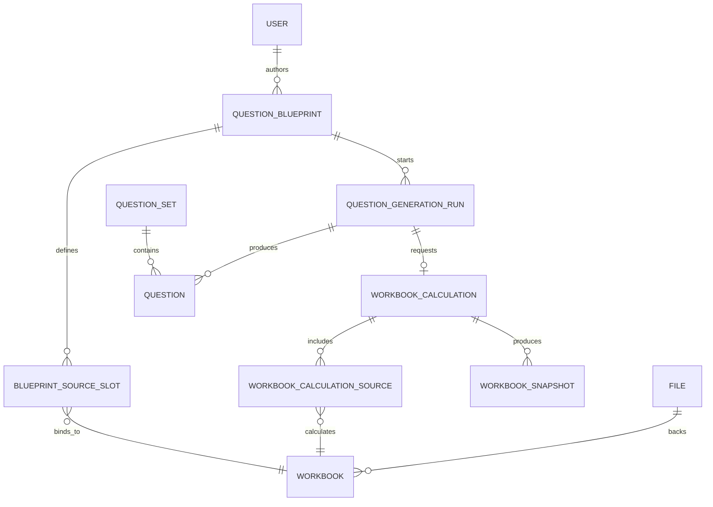

# Domain Model

## Core Terms

- Question blueprint: current editable question definition plus named source slots.
- Question set: collection of generated or curated questions.
- Question: playable question instance.
- Question generation run: asynchronous job that produces questions.
- Workbook: spreadsheet asset bound to blueprint source slots.
- Workbook snapshot: immutable sampled workbook state for one calculation source and question index.
- Workbook calculation: asynchronous sampling request covering all workbook sources frozen by a generation run.
- File upload: storage lifecycle record for uploaded content.
- Identity user: application user mapped from Keycloak.
- Outbox event: durable event used by workers and integrations.

## Relationships

## Generation Reliability

- Blueprints define current editable documents and multiple workbook-bound source slots.
- Generation runs orchestrate work and freeze blueprint documents plus source bindings as immutable inputs.
- Workbook calculations sample every frozen workbook source; snapshots preserve values per source and question index.
- Questions remember rendered body, private solution, source plan, and source evidence as durable playable artifacts.
- Viewing or grading questions reads persisted artifacts. It never recalculates workbooks.
- Retry creates replacement generation runs and replacement workbook calculations, preserving terminal history and retry lineage.

## Question Blocks

`QuestionBlueprintDocument` and materialized `QuestionBody` use
`schemaVersion: 2` for the composable block grammar. This is a breaking
pre-release schema change. Old v1 local documents using canonical `response`
blocks or table `content` / `response` cell variants are not migrated.

Every block has a taxonomy `kind`: `primitive`, `container`, or `complex`.

- Primitive blocks are the base runtime language: `text`, `rich_text`, `input`,
  and `separator`.
- Container blocks are flow/grouping nodes: `page` and `step`, each with
  ordered child `blocks`. A renderer may present them simply as titled wrappers,
  but the container node and child order are part of the canonical model.
- Complex blocks are composed structures over primitives. The table block is a
  complex block whose cells contain ordered primitive block arrays.

`input` replaces the old canonical `response` block. An input primitive owns the
answer position through `responseFieldId`; deeper input typing, default values,
option sets, and validation UX are future #86 layers.
Studio may still use "answer" or "response" in app-model names and user-facing
copy for the learner's answer position, but serialization maps that concept to
the canonical `input` primitive. OpenAPI/Hono/Zod generation validates recursive
container child blocks from the source contract through the shared
OpenAPI/Hono generator and Orval reusable Zod schema configuration; generated
schemas must not weaken nested `blocks` to arbitrary JSON or rely on
post-generation repair.

Private blueprint inputs with `grading.mode: "manual"` may omit
`correctValueSource`. Every non-manual grading mode requires a
`correctValueSource`; the domain and web authoring validation reject documents
that omit it. Switching an input to manual grading removes the private correct
source from the authoring model. Materialized and public input blocks never
expose grading, points, or correctness fields.

Tables are expressed as a matrix of rows, columns, and cells. Row IDs, column
IDs, and cell IDs are scoped to their owning table. Each cell has
`blocks: PrimitiveBlock[]`, so cells can contain `[text, input]`, multiple text
blocks, rich text, separators, or any other primitive sequence without
collapsing to a single legacy content/response variant. Spreadsheet-like table
editing and selection remain future #91 work.

Table-cell editing operations target primitive block IDs. Current Studio
surfaces may expose a primary text/input primitive for simple editing, but the
app-domain operation updates that selected primitive only; it does not mutate
every primitive of the same type in a cell.

Standalone table documents may store their prompt as an immediately preceding
text block with `id: "prompt"` before the `id: "table"` block. Composed
documents use the immediately preceding `${tableId}_prompt` convention. Prompt
lookup is intentionally same-list and adjacent-only, so text outside the table's
block list is not borrowed as a nested table prompt.

Block IDs are document-global across top-level blocks, nested container
children, and primitive blocks inside table cells. This avoids ambiguous future
references. Table row IDs, column IDs, and cell IDs remain table-scoped; future
#87 table references should use structured addresses such as
`{ tableBlockId, cellId, childBlockId }` when they need to target a primitive
inside a table cell. The generalized hidden reference dependency graph is still
future #87 work.

## Bounded Contexts

- `@lemma/identity`: users, roles, auth-facing identity operations.
- `@lemma/files`: upload and object storage lifecycle.
- `@lemma/workbook`: workbook registration, snapshots, calculations.
- `@lemma/questions`: authoring, generation, grading, question sets.
- `@lemma/events`: transactional outbox.
- `@lemma/notifications`: realtime auth and notification channels.
- `@lemma/ops`: operational views and repair actions.
