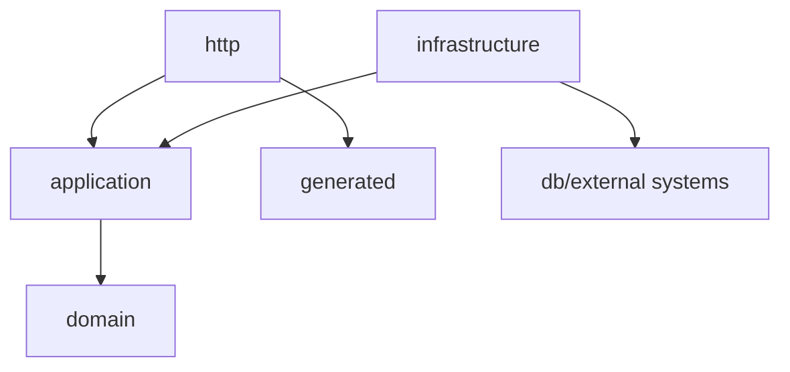

# Domain Package Guidelines

This document defines the rules for bounded-context packages such as
`@lemma/questions`, `@lemma/workbook`, `@lemma/files`, and `@lemma/identity`.

## Layer Responsibilities

```text
domain          business concepts, invariants, transitions, value objects
application     orchestration, policies, ports, transaction boundaries
infrastructure  Kysely repositories and external service adapters
http            handlers, presenters, OpenAPI-facing DTO mapping
generated             generated Hono/Zod/types output
```

## Dependency Direction



Rules:

- `domain` must not import `application`, `infrastructure`, `http`, or `generated`.
- `domain` must not import DB, Hono, Zod, Keycloak, storage clients, or generated OpenAPI code.
- `application` orchestrates domain behavior and calls ports.
- `infrastructure` implements ports and translates external failures.
- `http` maps requests/responses and errors; it must not create domain decisions.

## Domain Rules

- Use product language, not persistence or transport language.
- Put lifecycle transitions in domain entities or domain services.
- Keep domain services pure: no I/O, time reads, ID generation, or network calls.
- Validate value objects at construction boundaries.
- Reconstitute persisted state through domain constructors or dedicated factories.
- Fail fast if persisted state violates domain invariants.

## Error Rules

- Domain errors represent business-rule violations only.
- Not-found, forbidden/access, database, network, and provider failures are
  application or infrastructure errors.
- Application and infrastructure code should not manually throw domain errors to
  simulate domain decisions. Ask the domain model to perform the operation.

## ID, Time, And Side Effects

- Prefer branded IDs or shared ID helpers.
- Do not hand-roll UUID regexes in each domain.
- Domain code should not read current time; pass time in.
- Domain code should not generate IDs; pass IDs in.
- Domain code should not perform I/O.

## Canonical Shapes

- Domain packages should own canonical business shapes.
- OpenAPI DTOs and generated types are transport shapes, not domain truth.
- Question response bodies must not expose solution/grading-only data by default.
- Runtime/compiler-specific schemas must map into canonical domain models.

## Application Rules

Application services may:

- load aggregates
- call domain behavior
- enforce authorization and policy decisions
- call ports
- manage transactions
- publish outbox events

Application services should not:

- contain hidden domain-rule helpers
- mutate domain state directly
- call concrete infrastructure without a port
- decide persistence mapping details

## Infrastructure Rules

- Repositories map between persisted rows and domain/application models.
- Repositories do not decide business rules.
- External adapters translate provider errors into application/infrastructure errors.
- Infrastructure may depend on Kysely, S3/Garage clients, Keycloak clients, and runtime libraries.

## HTTP And OpenAPI Rules

- OpenAPI describes public HTTP contracts.
- Generated files are regenerated, not edited manually.
- HTTP handlers map transport DTOs to application commands and map application
  results back to response DTOs.
- HTTP error presenters centralize status-code decisions.
- HTTP presenter functions should return generated response DTO types from
  `src/generated/types` when a generated type exists.
- Name public response builders `present<Resource>` or `present<ResourcePlural>`;
  name private nested DTO mappers `to<Resource>Dto`.
- Keep domain/application models out of public HTTP responses unless the
  generated DTO type intentionally matches that shape.
- Put repeated response wrapper logic in small presenter helpers instead of
  duplicating ad hoc object shapes in handlers.

## Testing

- Domain tests should be pure unit tests.
- Application tests should verify orchestration, policy, transaction, and port behavior.
- Infrastructure tests should focus on mapping and adapter behavior where useful.
- HTTP tests should protect request/response and error mapping.

## Review Checklist

- Does `src/domain` avoid infrastructure/generated/HTTP imports?
- Are invariants enforced by domain code?
- Are domain errors specific business errors?
- Are infrastructure failures translated outside domain?
- Are application services orchestrating rather than deciding hidden domain rules?
- Are OpenAPI/generated changes regenerated?
- Are tests close to the behavior being changed?
